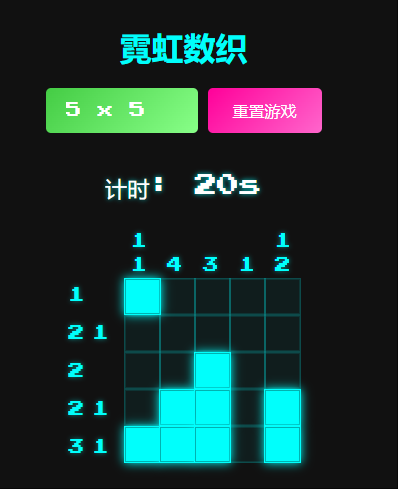

# 霓虹数织 - neon-nonogram

 

**霓虹数织** 是一款结合了数字逻辑和像素艺术的益智游戏。通过行列提示数字，填充网格以揭示隐藏的像素图案。本项目采用霓虹灯风格设计，提供沉浸式的解谜体验。

🌐 **项目地址**: [https://github.com/yviscool/neon-nonogram](https://github.com/yviscool/neon-nonogram)

---

## 🎮 功能特点

- **多种尺寸选择**：提供 5x5、10x10、15x15 等多种棋盘尺寸，适应不同难度需求。
- **霓虹灯主题**：采用鲜艳的霓虹色彩和发光效果，营造独特的视觉风格。
- **行列错误提示**：填充超出提示数字时，实时高亮显示错误行列。
- **计时与秒数统计**：精确记录游戏时间，挑战速度极限。
- **胜利烟花特效**：成功解谜后，绚丽的烟花效果庆祝胜利。
- **响应式布局**：完美适配桌面和移动端，随时随地畅玩数织。

---

## 🚀 使用方法

### 在线体验
访问 [neon-nonogram](https://neon-nonogram.vercel.app/) 即可立即体验在线版霓虹数织。

### 本地运行
1. 克隆项目到本地仓库：
   ```bash
   git clone [https://github.com/yviscool/neon-nonogram.git](https://www.google.com/search?q=https://github.com/yviscool/neon-nonogram.git)
   ```

2.  进入项目根目录：
    ```bash
    cd neon-nonogram
    ```
3.  使用浏览器打开 `index.html` 文件。

-----

## 🛠️ 技术栈

  - **HTML5**：构建游戏页面结构。
  - **CSS3**：实现霓虹灯风格样式和动画效果。
  - **JavaScript**：编写核心游戏逻辑和用户交互。
  - **SweetAlert2**：用于美观的胜利提示弹窗。
  - **tsParticles**：实现炫酷的烟花特效。

-----

## 📸 截图



-----

## 📜 许可证

本项目使用 **MIT 开源许可证**。 详细信息请查阅 [LICENSE](LICENSE) 文件。

-----

## 🤝 贡献指南

欢迎大家参与项目贡献！ 无论是代码改进还是问题反馈，都非常欢迎。

1.  Fork 本项目到你的 GitHub 仓库。
2.  创建新的功能分支 (`git checkout -b feature/NewFeature`)。
3.  提交代码更改 (`git commit -m 'Add new feature'`)。
4.  推送到你的分支 (`git push origin feature/NewFeature`)。
5.  提交 Pull Request 到主项目。

-----

## 📧 联系

如有任何疑问或建议，欢迎联系：  
🌐 **GitHub**: [yviscool](https://github.com/yviscool)

-----

**尽情享受霓虹数织的乐趣吧\! 🎉**

-----

```
